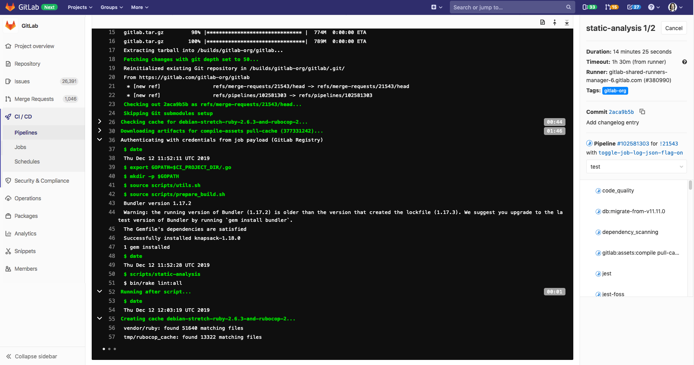
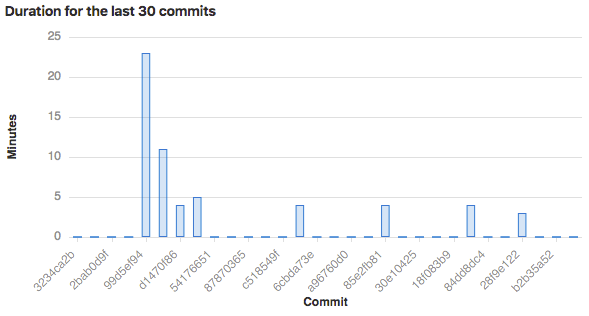
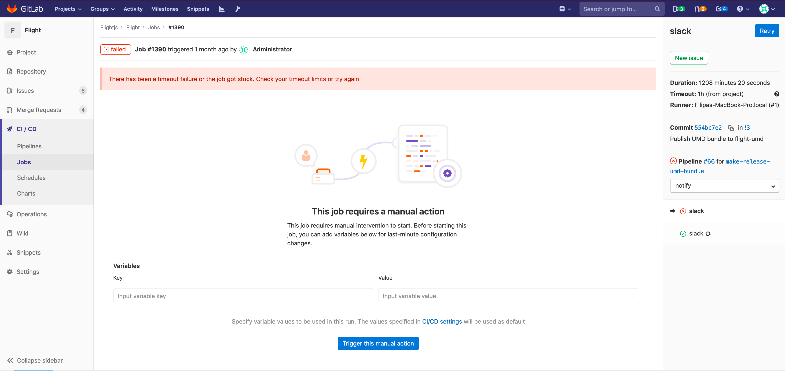

# Creating and using CI/CD pipelines

> Introduced in GitLab 8.8.

NOTE: **Tip:**
Watch our
["Mastering continuous software development"](https://about.gitlab.com/webcast/mastering-ci-cd/)
webcast to see a comprehensive demo of GitLab CI/CD pipeline.

## Introduction

Pipelines are the top-level component of continuous integration, delivery, and deployment.

Pipelines comprise:

- Jobs that define what to run. For example, code compilation or test runs.
- Stages that define when and how to run. For example, that tests run only after code compilation.

Multiple jobs in the same stage are executed by [Runners](../runners/README.md) in parallel, if there are enough concurrent [Runners](../runners/README.md).

If all the jobs in a stage:

- Succeed, the pipeline moves on to the next stage.
- Fail, the next stage is not (usually) executed and the pipeline ends early.

NOTE: **Note:**
If you have a [mirrored repository that GitLab pulls from](../../user/project/repository/repository_mirroring.md#pulling-from-a-remote-repository-starter),
you may need to enable pipeline triggering in your project's
**Settings > Repository > Pull from a remote repository > Trigger pipelines for mirror updates**.

### Simple pipeline example

As an example, imagine a pipeline consisting of four stages, executed in the following order:

- `build`, with a job called `compile`.
- `test`, with two jobs called `test` and `test2`.
- `staging`, with a job called `deploy-to-stage`.
- `production`, with a job called `deploy-to-prod`.

## Visualizing pipelines

> [Introduced](https://gitlab.com/gitlab-org/gitlab-foss/-/merge_requests/5742) in GitLab 8.11.

Pipelines can be complex structures with many sequential and parallel jobs.

To make it easier to understand the flow of a pipeline, GitLab has pipeline graphs for viewing pipelines
and their statuses.

Pipeline graphs can be displayed in two different ways, depending on the page you
access the graph from.

NOTE: **Note:**
GitLab capitalizes the stages' names when shown in the pipeline graphs (below).

### Regular pipeline graphs

Regular pipeline graphs show the names of the jobs of each stage. Regular pipeline graphs can
be found when you are on a [single pipeline page](#accessing-pipelines). For example:


### Pipeline mini graphs

Pipeline mini graphs take less space and can tell you at a
quick glance if all jobs passed or something failed. The pipeline mini graph can
be found when you navigate to:

- The pipelines index page.
- A single commit page.
- A merge request page.

Pipeline mini graphs allow you to see all related jobs for a single commit and the net result
of each stage of your pipeline. This allows you to quickly see what failed and
fix it.

Stages in pipeline mini graphs are collapsible. Hover your mouse over them and click to expand their jobs.

| Mini graph                                                   | Mini graph expanded                                            |
|:-------------------------------------------------------------|:---------------------------------------------------------------|
|  |  |

### Job ordering in pipeline graphs

Job ordering depends on the type of pipeline graph. For [regular pipeline graphs](#regular-pipeline-graphs), jobs are sorted by name.

For [pipeline mini graphs](#pipeline-mini-graphs) ([introduced](https://gitlab.com/gitlab-org/gitlab-foss/-/merge_requests/9760)
in GitLab 9.0), jobs are sorted by severity and then by name.

The order of severity is:

- failed
- warning
- pending
- running
- manual
- scheduled
- canceled
- success
- skipped
- created

For example:


### Expanding and collapsing job log sections

> [Introduced](https://gitlab.com/gitlab-org/gitlab-foss/issues/14664) in GitLab 12.0.

Job logs are divided into sections that can be collapsed or expanded. Each section will display
the duration.

In the following example:

- Two sections are collapsed and can be expanded.
- Three sections are expanded and can be collapsed.



#### Custom collapsible sections

You can create collapsible sections in job logs by manually outputting special codes
that GitLab will use to determine what sections to collapse:

- Section start marker: `section_start:UNIX_TIMESTAMP:SECTION_NAME\r\e[0K` + `TEXT_OF_SECTION_HEADER`
- Section end marker: `section_end:UNIX_TIMESTAMP:SECTION_NAME\r\e[0K`

You must add these codes to the script section of the CI configuration. For example,
using `echo`:

```yaml
job1:
  script:
    - echo -e "section_start:`date +%s`:my_first_section\r\e[0KHeader of the 1st collapsible section"
    - echo 'this line should be hidden when collapsed'
    - echo -e "section_end:`date +%s`:my_first_section\r\e[0K"
```

In the example above:

- `date +%s`: The Unix timestamp (for example `1560896352`).
- `my_first_section`: The name given to the section.
- `\r\e[0K`: Prevents the section markers from displaying in the rendered (colored)
  job log, but they are displayed in the raw job log. To see them, in the top right
  of the job log, click **{doc-text}** (**Show complete raw**).
  - `\r`: carriage return.
  - `\e[0K`: clear line ANSI escape code.

Sample raw job log:

```plaintext
section_start:1560896352:my_first_section\r\e[0KHeader of the 1st collapsible section
this line should be hidden when collapsed
section_end:1560896353:my_first_section\r\e[0K
```

### Pipeline success and duration charts

> - Introduced in GitLab 3.1.1 as Commit Stats, and later renamed to Pipeline Charts.
> - [Renamed](https://gitlab.com/gitlab-org/gitlab/issues/38318) to CI / CD Analytics in GitLab 12.8.

GitLab tracks the history of your pipeline successes and failures, as well as how long each pipeline ran. To view this information, go to **Analytics > CI / CD Analytics**.

View successful pipelines:


View pipeline duration history:



## Pipeline quotas

Each user has a personal pipeline quota that tracks the usage of shared runners in all personal projects.
Each group has a [usage quota](../../subscriptions/index.md#ci-pipeline-minutes) that tracks the usage of shared runners for all projects created within the group.

When a pipeline is triggered, regardless of who triggered it, the pipeline quota for the project owner's [namespace](../../user/group/index.md#namespaces) is used. In this case, the namespace can be the user or group that owns the project.

### How pipeline duration is calculated

Total running time for a given pipeline excludes retries and pending
(queued) time.

Each job is represented as a `Period`, which consists of:

- `Period#first` (when the job started).
- `Period#last` (when the job finished).

A simple example is:

- A (1, 3)
- B (2, 4)
- C (6, 7)

In the example:

- A begins at 1 and ends at 3.
- B begins at 2 and ends at 4.
- C begins at 6 and ends at 7.

Visually, it can be viewed as:

```text
0  1  2  3  4  5  6  7
   AAAAAAA
      BBBBBBB
                  CCCC
```

The union of A, B, and C is (1, 4) and (6, 7). Therefore, the total running time is:

```text
(4 - 1) + (7 - 6) => 4
```

## Configuring pipelines

Pipelines, and their component jobs and stages, are defined in the [`.gitlab-ci.yml`](../yaml/README.md) file for each project.

In particular:

- Jobs are the [basic configuration](../yaml/README.md#introduction) component.
- Stages are defined using the [`stages`](../yaml/README.md#stages) keyword.

For all available configuration options, see the [GitLab CI/CD Pipeline Configuration Reference](../yaml/README.md).

### Settings and schedules

In addition to configuring jobs through `.gitlab-ci.yml`, additional configuration options are available
through the GitLab UI:

- Pipeline settings for each project. For more information, see [Pipeline settings](settings.md).
- Schedules for pipelines. For more information, see [Pipeline schedules](schedules.md).

### Grouping jobs

> [Introduced](https://gitlab.com/gitlab-org/gitlab-foss/-/merge_requests/6242) in GitLab 8.12.

If you have many similar jobs, your [pipeline graph](#visualizing-pipelines) becomes long and hard
to read.

For that reason, similar jobs can automatically be grouped together.
If the job names are formatted in certain ways, they will be collapsed into
a single group in regular pipeline graphs (not the mini graphs).

You'll know when a pipeline has grouped jobs if you don't see the retry or
cancel button inside them. Hovering over them will show the number of grouped
jobs. Click to expand them.


#### Configuring grouping

In the pipeline [configuration file](../yaml/README.md), job names must include two numbers separated with one of
the following (you can even use them interchangeably):

- A space.
- A slash (`/`).
- A colon (`:`).

NOTE: **Note:**
More specifically, it uses [this](https://gitlab.com/gitlab-org/gitlab/blob/2f3dc314f42dbd79813e6251792853bc231e69dd/app/models/commit_status.rb#L99) regular expression: `\d+[\s:\/\\]+\d+\s*`.

#### How grouping works

The jobs will be ordered by comparing those two numbers from left to right. You
usually want the first to be the index and the second the total.

For example, the following jobs will be grouped under a job named `test`:

- `test 0 3`
- `test 1 3`
- `test 2 3`

The following jobs will be grouped under a job named `test ruby`:

- `test 1:2 ruby`
- `test 2:2 ruby`

The following jobs will be grouped under a job named `test ruby` as well:

- `1/3 test ruby`
- `2/3 test ruby`
- `3/3 test ruby`

### Pipelines for merge requests

GitLab supports configuring pipelines that run only for merge requests. For more information, see
[Pipelines for merge requests](../merge_request_pipelines/index.md).

### Badges

Pipeline status and test coverage report badges are available and configurable for each project.

For information on adding pipeline badges to projects, see [Pipeline badges](settings.md#pipeline-badges).

## Multi-project pipelines

Pipelines for different projects can be combined together into [Multi-project pipelines](../multi_project_pipelines.md).

[Multi-project pipeline graphs](../multi_project_pipelines.md#multi-project-pipeline-visualization-premium) help
you visualize the entire pipeline, including all cross-project inter-dependencies. **(PREMIUM)**

## Parent-child pipelines

Complex pipelines can be broken down into one parent pipeline that can trigger
multiple child sub-pipelines, which all run in the same project and with the same SHA.

For more information, see [Parent-Child pipelines](../parent_child_pipelines.md).

## Working with pipelines

In general, pipelines are executed automatically and require no intervention once created.

However, there are instances where you'll need to interact with pipelines. These are documented below.

### Manually executing pipelines

Pipelines can be manually executed, with predefined or manually-specified [variables](../variables/README.md).

You might do this if the results of a pipeline (for example, a code build) is required outside the normal
operation of the pipeline.

To execute a pipeline manually:

1. Navigate to your project's **CI/CD > Pipelines**.
1. Click on the **Run Pipeline** button.
1. On the **Run Pipeline** page:
    1. Select the branch to run the pipeline for in the **Create for** field.
    1. Enter any [environment variables](../variables/README.md) required for the pipeline run.
    1. Click the **Create pipeline** button.

The pipeline will execute the jobs as configured.

#### Using a query string

> [Introduced](https://gitlab.com/gitlab-org/gitlab/issues/24146) in GitLab 12.5.

Variables on the **Run Pipeline** page can be pre-populated by passing variable keys and values
in a query string appended to the `pipelines/new` URL. The format is:

```plaintext
.../pipelines/new?ref=<branch>&var[<variable_key>]=<value>&file_var[<file_key>]=<value>
```

The following parameters are supported:

- `ref`: specify the branch to populate the **Run for** field with.
- `var`: specify a `Variable` variable.
- `file_var`: specify a `File` variable.

For each `var` or `file_var`, a key and value are required.

For example, the query string
`.../pipelines/new?ref=my_branch&var[foo]=bar&file_var[file_foo]=file_bar` will pre-populate the
**Run Pipeline** page as follows:

- **Run for** field: `my_branch`.
- **Variables** section:
  - Variable:
    - Key: `foo`
    - Value: `bar`
  - File:
    - Key: `file_foo`
    - Value: `file_bar`

### Accessing pipelines

You can find the current and historical pipeline runs under your project's
**CI/CD > Pipelines** page. You can also access pipelines for a merge request by navigating
to its **Pipelines** tab.


Clicking on a pipeline will bring you to the **Pipeline Details** page and show
the jobs that were run for that pipeline. From here you can cancel a running pipeline,
retry jobs on a failed pipeline, or [delete a pipeline](#deleting-a-single-pipeline).

### Accessing individual jobs

When you access a pipeline, you can see the related jobs for that pipeline.

Clicking on an individual job will show you its job log, and allow you to:

- Cancel the job.
- Retry the job.
- Erase the job log.

### Seeing the failure reason for jobs

> [Introduced](https://gitlab.com/gitlab-org/gitlab-foss/-/merge_requests/17782) in GitLab 10.7.

When a pipeline fails or is allowed to fail, there are several places where you
can quickly check the reason it failed:

- In the pipeline graph, on the pipeline detail view.
- In the pipeline widgets, in the merge requests and commit pages.
- In the job views, in the global and detailed views of a job.

In each place, if you hover over the failed job you can see the reason it failed.


From [GitLab 10.8](https://gitlab.com/gitlab-org/gitlab-foss/-/merge_requests/17814),
you can also see the reason it failed on the Job detail page.

### Manual actions from pipeline graphs

> [Introduced](https://gitlab.com/gitlab-org/gitlab-foss/-/merge_requests/7931) in GitLab 8.15.

Manual actions, configured using the [`when:manual`](../yaml/README.md#whenmanual) parameter,
allow you to require manual interaction before moving forward in the pipeline.

You can do this straight from the pipeline graph. Just click on the play button
to execute that particular job.

For example, your pipeline start automatically, but require manual action to
[deploy to production](../environments.md#configuring-manual-deployments). In the example below, the `production`
stage has a job with a manual action.


### Specifying variables when running manual jobs

> [Introduced](https://gitlab.com/gitlab-org/gitlab-foss/-/merge_requests/30485) in GitLab 12.2.

When running manual jobs you can supply additional job specific variables.

You can do this from the job page of the manual job you want to run with
additional variables.

This is useful when you want to alter the execution of a job by using
environment variables.



### Delay a job in a pipeline graph

> [Introduced](https://gitlab.com/gitlab-org/gitlab-foss/-/merge_requests/21767) in GitLab 11.4.

When you do not want to run a job immediately, you can use the [`when:delayed`](../yaml/README.md#whendelayed) parameter to
delay a job's execution for a certain period.

This is especially useful for timed incremental rollout where new code is rolled out gradually.

For example, if you start rolling out new code and:

- Users do not experience trouble, GitLab can automatically complete the deployment from 0% to 100%.
- Users experience trouble with the new code, you can stop the timed incremental rollout by canceling the pipeline
  and [rolling](../environments.md#retrying-and-rolling-back) back to the last stable version.


### Using the API

GitLab provides API endpoints to:

- Perform basic functions. For more information, see [Pipelines API](../../api/pipelines.md).
- Maintain pipeline schedules. For more information, see [Pipeline schedules API](../../api/pipeline_schedules.md).
- Trigger pipeline runs. For more information, see:
  - [Triggering pipelines through the API](../triggers/README.md).
  - [Pipeline triggers API](../../api/pipeline_triggers.md).

### Start multiple manual actions in a stage

> [Introduced](https://gitlab.com/gitlab-org/gitlab-foss/-/merge_requests/27188) in GitLab 11.11.

Multiple manual actions in a single stage can be started at the same time using the "Play all manual" button.
Once the user clicks this button, each individual manual action will be triggered and refreshed
to an updated status.

This functionality is only available:

- For users with at least Developer access.
- If the the stage contains [manual actions](#manual-actions-from-pipeline-graphs).

### Deleting a single pipeline

> [Introduced](https://gitlab.com/gitlab-org/gitlab/issues/24851) in GitLab 12.7.

Users with [owner permissions](../../user/permissions.md) in a project can delete a pipeline
by clicking on the pipeline in the **CI/CD > Pipelines** to get to the **Pipeline Details**
page, then using the **Delete** button.


CAUTION: **Warning:**
Deleting a pipeline will expire all pipeline caches, and delete all related objects,
such as builds, logs, artifacts, and triggers. **This action cannot be undone.**

## Most Recent Pipeline

> [Introduced](https://gitlab.com/gitlab-org/gitlab-foss/issues/50499) in GitLab 12.3.

There's a link to the latest pipeline for the last commit of a given branch at `/project/pipelines/[branch]/latest`. Also, `/project/pipelines/latest` will redirect you to the latest pipeline for the last commit on the project's default branch.

## Security on protected branches

A strict security model is enforced when pipelines are executed on
[protected branches](../../user/project/protected_branches.md).

The following actions are allowed on protected branches only if the user is
[allowed to merge or push](../../user/project/protected_branches.md#using-the-allowed-to-merge-and-allowed-to-push-settings)
on that specific branch:

- Run manual pipelines (using the [Web UI](#manually-executing-pipelines) or pipelines API).
- Run scheduled pipelines.
- Run pipelines using triggers.
- Trigger manual actions on existing pipelines.
- Retry or cancel existing jobs (using the Web UI or pipelines API).

**Variables** marked as **protected** are accessible only to jobs that
run on protected branches, preventing untrusted users getting unintended access to
sensitive information like deployment credentials and tokens.

**Runners** marked as **protected** can run jobs only on protected
branches, avoiding untrusted code to be executed on the protected runner and
preserving deployment keys and other credentials from being unintentionally
accessed. In order to ensure that jobs intended to be executed on protected
runners will not use regular runners, they must be tagged accordingly.

## Persistent pipeline refs

> [Introduced](https://gitlab.com/gitlab-org/gitlab/-/merge_requests/17043) in GitLab 12.4.

Previously, you'd have encountered unexpected pipeline failures when you force-pushed
a branch to its remote repository. To illustrate the problem, suppose you've had the current workflow:

1. A user creates a feature branch named `example` and pushes it to a remote repository.
1. A new pipeline starts running on the `example` branch.
1. A user rebases the `example` branch on the latest `master` branch and force-pushes it to its remote repository.
1. A new pipeline starts running on the `example` branch again, however,
   the previous pipeline (2) fails because of `fatal: reference is not a tree:` error.

This is because the previous pipeline cannot find a checkout-SHA (which associated with the pipeline record)
from the `example` branch that the commit history has already been overwritten by the force-push.
Similarly, [Pipelines for merged results](../merge_request_pipelines/pipelines_for_merged_results/index.md)
might have failed intermittently due to [the same reason](../merge_request_pipelines/pipelines_for_merged_results/index.md#intermittently-pipelines-fail-by-fatal-reference-is-not-a-tree-error).

As of GitLab 12.4, we've improved this behavior by persisting pipeline refs exclusively.
To illustrate its life cycle:

1. A pipeline is created on a feature branch named `example`.
1. A persistent pipeline ref is created at `refs/pipelines/<pipeline-id>`,
   which retains the checkout-SHA of the associated pipeline record.
   This persistent ref stays intact during the pipeline execution,
   even if the commit history of the `example` branch has been overwritten by force-push.
1. GitLab Runner fetches the persistent pipeline ref and gets source code from the checkout-SHA.
1. When the pipeline finished, its persistent ref is cleaned up in a background process.

NOTE: **NOTE**: At this moment, this feature is on by default and can be manually disabled
by disabling `depend_on_persistent_pipeline_ref` feature flag. If you're interested in
manually disabling this behavior, please ask the administrator
to execute the following commands in rails console.

```shell
> sudo gitlab-rails console                                        # Login to Rails console of GitLab instance.
> project = Project.find_by_full_path('namespace/project-name')    # Get the project instance.
> Feature.disable(:depend_on_persistent_pipeline_ref, project)     # Disable the feature flag for specific project
> Feature.disable(:depend_on_persistent_pipeline_ref)              # Disable the feature flag system-wide
```
