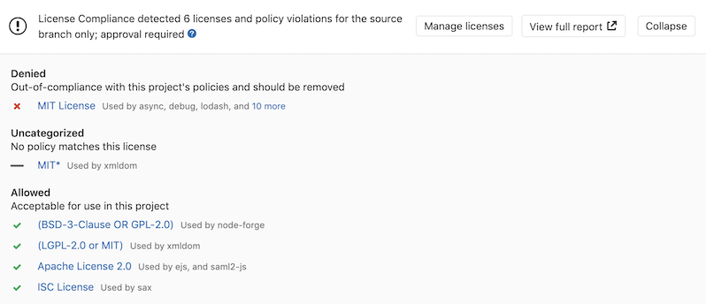
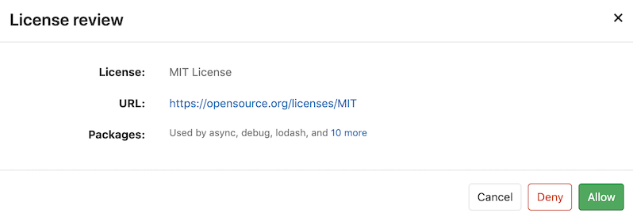
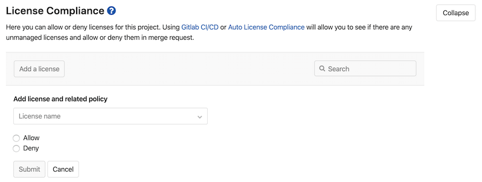
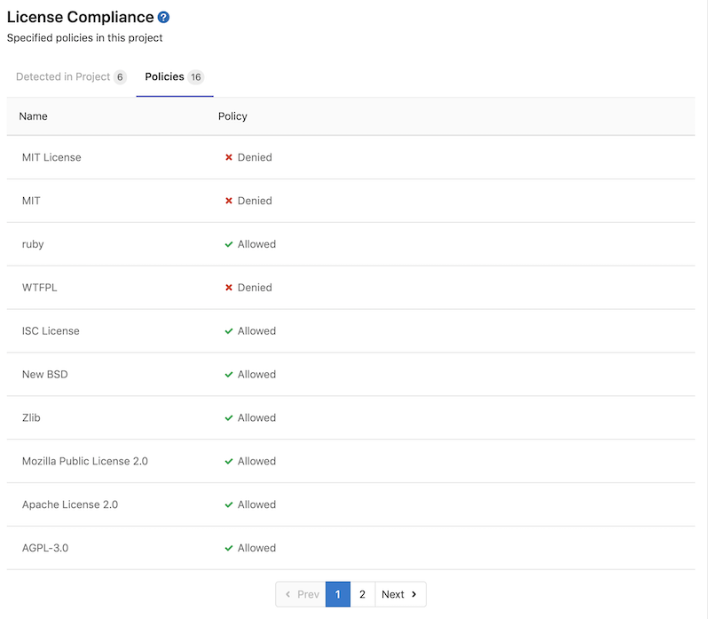

# License Compliance **(ULTIMATE)**

> [Introduced](https://gitlab.com/gitlab-org/gitlab/issues/5483) in [GitLab Ultimate](https://about.gitlab.com/pricing/) 11.0.

## Overview

If you are using [GitLab CI/CD](../../../ci/README.md), you can search your project dependencies for their licenses
using License Compliance.

You can take advantage of License Compliance by either [including the job](#configuration)
in your existing `.gitlab-ci.yml` file or by implicitly using
[Auto License Compliance](../../../topics/autodevops/stages.md#auto-license-compliance-ultimate)
that is provided by [Auto DevOps](../../../topics/autodevops/index.md).

GitLab checks the License Compliance report, compares the licenses between the
source and target branches, and shows the information right on the merge request.
Denied licenses will be clearly visible with an `x` red icon next to them
as well as new licenses which need a decision from you. In addition, you can
[manually allow or deny](#project-policies-for-license-compliance)
licenses in your project's settings.

NOTE: **Note:**
If the license compliance report doesn't have anything to compare to, no information
will be displayed in the merge request area. That is the case when you add the
`license_scanning` job in your `.gitlab-ci.yml` for the first time.
Consecutive merge requests will have something to compare to and the license
compliance report will be shown properly.



If you are a project or group Maintainer, you can click on a license to be given
the choice to allow it or deny it.



When GitLab detects a **Denied** license, you can view it in the [license list](#license-list).


You can view and modify existing policies from the [policies](#policies) tab.


## Use cases

It helps you find what licenses your project uses in its dependencies, and decide for each of then
whether to allow it or forbid it. For example, your application is using an external (open source)
library whose license is incompatible with yours.

## Supported languages and package managers

The following languages and package managers are supported.

| Language   | Package managers                                                  | Scan Tool                                                |
|------------|-------------------------------------------------------------------|----------------------------------------------------------|
| JavaScript | [Bower](https://bower.io/), [npm](https://www.npmjs.com/) |[License Finder](https://github.com/pivotal/LicenseFinder)|
| Go         | [Godep](https://github.com/tools/godep), [go mod](https://github.com/golang/go/wiki/Modules) |[License Finder](https://github.com/pivotal/LicenseFinder)|
| Java       | [Gradle](https://gradle.org/), [Maven](https://maven.apache.org/) |[License Finder](https://github.com/pivotal/LicenseFinder)|
| .NET       | [Nuget](https://www.nuget.org/) (.NET Framework is supported via the [mono project](https://www.mono-project.com/). Windows specific dependencies are not supported at this time.)  |[License Finder](https://github.com/pivotal/LicenseFinder)|
| Python     | [pip](https://pip.pypa.io/en/stable/) (Python is supported through [requirements.txt](https://pip.readthedocs.io/en/1.1/requirements.html) and [Pipfile.lock](https://github.com/pypa/pipfile#pipfilelock).) |[License Finder](https://github.com/pivotal/LicenseFinder)|
| Ruby       | [gem](https://rubygems.org/) |[License Finder](https://github.com/pivotal/LicenseFinder)|
| Objective-C, Swift | [Carthage](https://github.com/Carthage/Carthage) |[License Finder](https://github.com/pivotal/LicenseFinder)|

### Experimental support

The following languages and package managers are [supported experimentally](https://github.com/pivotal/LicenseFinder#experimental-project-types),
which means that the reported licenses might be incomplete or inaccurate.

| Language   | Package managers                                                  | Scan Tool                                                |
|------------|-------------------------------------------------------------------|----------------------------------------------------------|
| JavaScript | [yarn](https://yarnpkg.com/)|[License Finder](https://github.com/pivotal/LicenseFinder)|
| Go         | go get, gvt, glide, dep, trash, govendor |[License Finder](https://github.com/pivotal/LicenseFinder)|
| Erlang     | [rebar](https://www.rebar3.org/) |[License Finder](https://github.com/pivotal/LicenseFinder)|
| Objective-C, Swift | [CocoaPods](https://cocoapods.org/) v0.39 and below |[License Finder](https://github.com/pivotal/LicenseFinder)|
| Elixir     | [mix](https://elixir-lang.org/getting-started/mix-otp/introduction-to-mix.html) |[License Finder](https://github.com/pivotal/LicenseFinder)|
| C++/C      | [conan](https://conan.io/) |[License Finder](https://github.com/pivotal/LicenseFinder)|
| Scala      | [sbt](https://www.scala-sbt.org/) |[License Finder](https://github.com/pivotal/LicenseFinder)|
| Rust       | [cargo](https://crates.io/) |[License Finder](https://github.com/pivotal/LicenseFinder)|
| PHP        | [composer](https://getcomposer.org/) |[License Finder](https://github.com/pivotal/LicenseFinder)|

## Requirements

To run a License Compliance scanning job, you need GitLab Runner with the
[`docker` executor](https://docs.gitlab.com/runner/executors/docker.html).

## Configuration

For GitLab 12.8 and later, to enable License Compliance, you must
[include](../../../ci/yaml/README.md#includetemplate) the
[`License-Scanning.gitlab-ci.yml` template](https://gitlab.com/gitlab-org/gitlab/blob/master/lib/gitlab/ci/templates/Security/License-Scanning.gitlab-ci.yml)
that's provided as a part of your GitLab installation.
For older versions of GitLab from 11.9 to 12.7, you must
[include](../../../ci/yaml/README.md#includetemplate) the
[`License-Management.gitlab-ci.yml` template](https://gitlab.com/gitlab-org/gitlab/blob/master/lib/gitlab/ci/templates/Security/License-Management.gitlab-ci.yml).
For GitLab versions earlier than 11.9, you can copy and use the job as defined
that template.

NOTE: **Note:**
In GitLab 13.0, the `License-Management.gitlab-ci.yml` template is scheduled to be removed.
Use `License-Scanning.gitlab-ci.yml` instead.

Add the following to your `.gitlab-ci.yml` file:

```yaml
include:
  - template: License-Scanning.gitlab-ci.yml
```

The included template will create a `license_scanning` job in your CI/CD pipeline
and scan your dependencies to find their licenses.

NOTE: **Note:**
Before GitLab 12.8, the `license_scanning` job was named `license_management`.
In GitLab 13.0, the `license_management` job is scheduled to be removed completely,
so you're advised to migrate to the `license_scanning` job and used the new
`License-Scanning.gitlab-ci.yml` template.

The results will be saved as a
[License Compliance report artifact](../../../ci/pipelines/job_artifacts.md#artifactsreportslicense_scanning-ultimate)
that you can later download and analyze. Due to implementation limitations, we
always take the latest License Compliance artifact available. Behind the scenes, the
[GitLab License Compliance Docker image](https://gitlab.com/gitlab-org/security-products/license-management)
is used to detect the languages/frameworks and in turn analyzes the licenses.

The License Compliance settings can be changed through [environment variables](#available-variables) by using the
[`variables`](../../../ci/yaml/README.md#variables) parameter in `.gitlab-ci.yml`.

### Available variables

License Compliance can be configured using environment variables.

| Environment variable        | Required | Description |
|-----------------------------|----------|-------------|
| `SECURE_ANALYZERS_PREFIX`   | no       | Set the Docker registry base address to download the analyzer from. |
| `ADDITIONAL_CA_CERT_BUNDLE` | no       | Bundle of trusted CA certificates (currently supported in Pip, Pipenv, Maven, Gradle, and NPM projects). |
| `GRADLE_CLI_OPTS`           | no       | Additional arguments for the gradle executable. If not supplied, defaults to `--exclude-task=test`. |
| `LICENSE_FINDER_CLI_OPTS`   | no       | Additional arguments for the `license_finder` executable. For example, if your project has both Golang and Ruby code stored in different directories and you want to only scan the Ruby code, you can update your `.gitlab-ci-yml` template to specify which project directories to scan, like `LICENSE_FINDER_CLI_OPTS: '--debug --aggregate-paths=. ruby'`. |
| `LM_JAVA_VERSION`           | no       | Version of Java. If set to `11`, Maven and Gradle use Java 11 instead of Java 8. |
| `LM_PYTHON_VERSION`         | no       | Version of Python. If set to `3`, dependencies are installed using Python 3 instead of Python 2.7. |
| `MAVEN_CLI_OPTS`            | no       | Additional arguments for the mvn executable. If not supplied, defaults to `-DskipTests`. |
| `PIP_INDEX_URL`             | no       | Base URL of Python Package Index (default: `https://pypi.org/simple/`). |
| `SETUP_CMD`                 | no       | Custom setup for the dependency installation (experimental). |

### Installing custom dependencies

> Introduced in [GitLab Ultimate](https://about.gitlab.com/pricing/) 11.4.

The `license_management` image already embeds many auto-detection scripts, languages,
and packages. Nevertheless, it's almost impossible to cover all cases for all projects.
That's why sometimes it's necessary to install extra packages, or to have extra steps
in the project automated setup, like the download and installation of a certificate.
For that, a `LICENSE_MANAGEMENT_SETUP_CMD` environment variable can be passed to the container,
with the required commands to run before the license detection.

If present, this variable will override the setup step necessary to install all the packages
of your application (e.g.: for a project with a `Gemfile`, the setup step could be
`bundle install`).

For example:

```yaml
include:
  - template: License-Scanning.gitlab-ci.yml

variables:
  LICENSE_MANAGEMENT_SETUP_CMD: sh my-custom-install-script.sh
```

In this example, `my-custom-install-script.sh` is a shell script at the root
directory of your project.

### Overriding the template

CAUTION: **Deprecation:**
Beginning in GitLab 13.0, the use of [`only` and `except`](../../../ci/yaml/README.md#onlyexcept-basic)
is no longer supported. When overriding the template, you must use [`rules`](../../../ci/yaml/README.md#rules) instead.

If you want to override the job definition (for example, change properties like
`variables` or `dependencies`), you need to declare a `license_scanning` job
after the template inclusion and specify any additional keys under it. For example:

```yaml
include:
  - template: License-Scanning.gitlab-ci.yml

license_scanning:
  variables:
    CI_DEBUG_TRACE: "true"
```

### Configuring Maven projects

The License Compliance tool provides a `MAVEN_CLI_OPTS` environment variable which can hold
the command line arguments to pass to the `mvn install` command which is executed under the hood.
Feel free to use it for the customization of Maven execution. For example:

```yaml
include:
  - template: License-Scanning.gitlab-ci.yml

license_scanning:
  variables:
    MAVEN_CLI_OPTS: --debug
```

`mvn install` runs through all of the [build life cycle](http://maven.apache.org/guides/introduction/introduction-to-the-lifecycle.html)
stages prior to `install`, including `test`. Running unit tests is not directly
necessary for the license scanning purposes and consumes time, so it's skipped
by having the default value of `MAVEN_CLI_OPTS` as `-DskipTests`. If you want
to supply custom `MAVEN_CLI_OPTS` and skip tests at the same time, don't forget
to explicitly add `-DskipTests` to your options.
If you still need to run tests during `mvn install`, add `-DskipTests=false` to
`MAVEN_CLI_OPTS`.

#### Using private Maven repos

If you have a private Maven repository which requires login credentials,
you can use the `MAVEN_CLI_OPTS` environment variable.

Read more on [how to use private Maven repos](../../application_security/index.md#using-private-maven-repos).

You can also use `MAVEN_CLI_OPTS` to connect to a trusted Maven repository that uses a self-signed
or internally trusted certificate. For example:

```yaml
include:
  - template: License-Scanning.gitlab-ci.yml

license_scanning:
  variables:
    MAVEN_CLI_OPTS: -Dmaven.wagon.http.ssl.allowall=true -Dmaven.wagon.http.ssl.ignore.validity.dates=true -Dmaven.wagon.http.ssl.insecure=true
```

Alternatively, you can use a Java key store to verify the TLS connection. For instructions on how to
generate a key store file, see the
[Maven Guide to Remote repository access through authenticated HTTPS](http://maven.apache.org/guides/mini/guide-repository-ssl.html).

### Selecting the version of Python

> - [Introduced](https://gitlab.com/gitlab-org/security-products/license-management/-/merge_requests/36) in [GitLab Ultimate](https://about.gitlab.com/pricing/) 12.0.
> - In [GitLab 12.2](https://gitlab.com/gitlab-org/gitlab/issues/12032), Python 3.5 became the default.
> - In [GitLab 12.7](https://gitlab.com/gitlab-org/security-products/license-management/-/merge_requests/101), Python 3.8 became the default.

License Compliance uses Python 3.8 and pip 19.1 by default.
If your project requires Python 2, you can switch to Python 2.7 and pip 10.0
by setting the `LM_PYTHON_VERSION` environment variable to `2`.

```yaml
include:
  - template: License-Scanning.gitlab-ci.yml

license_scanning:
  variables:
    LM_PYTHON_VERSION: 2
```

### Custom root certificates for Python

You can supply a custom root certificate to complete TLS verification by using the
`ADDITIONAL_CA_CERT_BUNDLE` [environment variable](#available-variables).

To bypass TLS verification, you can use a custom [`pip.conf`](https://pip.pypa.io/en/stable/user_guide/#config-file)
file to configure trusted hosts.

The following `gitlab-ci.yml` file uses a [`before_script`](../../../ci/yaml/README.md#before_script-and-after_script)
to inject a custom [`pip.conf`](https://pip.pypa.io/en/stable/user_guide/#config-file):

```yaml
include:
  - template: License-Scanning.gitlab-ci.yml

license_scanning:
  variables:
    PIP_INDEX_URL: 'https://pypi.example.com/simple/'
  before_script:
    - mkdir -p ~/.config/pip/
    - cp pip.conf ~/.config/pip/pip.conf
```

The [`pip.conf`](https://pip.pypa.io/en/stable/reference/pip/) allows you to specify a list of
[trusted hosts](https://pip.pypa.io/en/stable/reference/pip/#cmdoption-trusted-host):

```text
[global]
trusted-host = pypi.example.com
```

#### Using private Python repos

If you have a private Python repository you can use the `PIP_INDEX_URL` [environment variable](#available-variables)
to specify its location. It's also possible to provide a custom `pip.conf` for
[additional configuration](#custom-root-certificates-for-python).

### Configuring NPM projects

You can configure NPM projects by using an [`.npmrc`](https://docs.npmjs.com/configuring-npm/npmrc.html)
file.

#### Using private NPM registries

If you have a private NPM registry you can use the
[`registry`](https://docs.npmjs.com/using-npm/config#registry)
setting to specify its location.

For example:

```text
registry = https://npm.example.com
```

#### Custom root certificates for NPM

You can supply a custom root certificate to complete TLS verification by using the
`ADDITIONAL_CA_CERT_BUNDLE` [environment variable](#available-variables).

To disable TLS verification you can provide the [`strict-ssl`](https://docs.npmjs.com/using-npm/config#strict-ssl)
setting.

For example:

```text
strict-ssl = false
```

### Configuring Yarn projects

You can configure Yarn projects by using a [`.yarnrc.yml`](https://yarnpkg.com/configuration/yarnrc)
file.

#### Using private Yarn registries

If you have a private Yarn registry you can use the
[`npmRegistryServer`](https://yarnpkg.com/configuration/yarnrc#npmRegistryServer)
setting to specify its location.

For example:

```text
npmRegistryServer: "https://npm.example.com"
```

#### Custom root certificates for Yarn

You can supply a custom root certificate to complete TLS verification by using the
`ADDITIONAL_CA_CERT_BUNDLE` [environment variable](#available-variables).

### Migration from `license_management` to `license_scanning`

In GitLab 12.8 a new name for `license_management` job was introduced. This change was made to improve clarity around the purpose of the scan, which is to scan and collect the types of licenses present in a projects dependencies.
The support of `license_management` is scheduled to be dropped in GitLab 13.0.
If you're using a custom setup for License Compliance, you're required
to update your CI config accordingly:

1. Change the CI template to `License-Scanning.gitlab-ci.yml`.
1. Change the job name to `license_scanning` (if you mention it in `.gitlab-ci.yml`).
1. Change the artifact name to `gl-license-scanning-report.json` (if you mention it in `.gitlab-ci.yml`).

For example, the following `.gitlab-ci.yml`:

```yaml
include:
  - template: License-Management.gitlab-ci.yml

license_management:
  artifacts:
    reports:
      license_management: gl-license-management-report.json
```

Should be changed to:

```yaml
include:
  - template: License-Scanning.gitlab-ci.yml

license_scanning:
  artifacts:
    reports:
      license_scanning: gl-license-scanning-report.json
```

## Running License Compliance in an offline environment

For self-managed GitLab instances in an environment with limited, restricted, or intermittent access
to external resources through the internet, some adjustments are required for the License Compliance job to
successfully run. For more information, see [Offline environments](../../application_security/offline_deployments/index.md).

### Requirements for offline License Compliance

To use License Compliance in an offline environment, you need:

- GitLab Runner with the [`docker` or `kubernetes` executor](#requirements).
- Docker Container Registry with locally available copies of License Compliance [analyzer](https://gitlab.com/gitlab-org/security-products/analyzers) images.

NOTE: **Note:**
GitLab Runner has a [default `pull policy` of `always`](https://docs.gitlab.com/runner/executors/docker.html#using-the-always-pull-policy),
meaning the Runner tries to pull Docker images from the GitLab container registry even if a local
copy is available. GitLab Runner's [`pull_policy` can be set to `if-not-present`](https://docs.gitlab.com/runner/executors/docker.html#using-the-if-not-present-pull-policy)
in an offline environment if you prefer using only locally available Docker images. However, we
recommend keeping the pull policy setting to `always` if not in an offline environment, as this
enables the use of updated scanners in your CI/CD pipelines.

### Make GitLab License Compliance analyzer images available inside your Docker registry

For License Compliance with all [supported languages and package managers](#supported-languages-and-package-managers),
import the following default License Compliance analyzer images from `registry.gitlab.com` to your
offline [local Docker container registry](../../packages/container_registry/index.md):

```plaintext
registry.gitlab.com/gitlab-org/security-products/license-management:latest
```

The process for importing Docker images into a local offline Docker registry depends on
**your network security policy**. Please consult your IT staff to find an accepted and approved
process by which external resources can be imported or temporarily accessed. Note that these scanners are [updated periodically](../../application_security/index.md#maintenance-and-update-of-the-vulnerabilities-database)
with new definitions, so consider if you are able to make periodic updates yourself.

For details on saving and transporting Docker images as a file, see Docker's documentation on
[`docker save`](https://docs.docker.com/engine/reference/commandline/save/), [`docker load`](https://docs.docker.com/engine/reference/commandline/load/),
[`docker export`](https://docs.docker.com/engine/reference/commandline/export/), and [`docker import`](https://docs.docker.com/engine/reference/commandline/import/).

### Set License Compliance CI job variables to use local License Compliance analyzers

Add the following configuration to your `.gitlab-ci.yml` file. You must replace `image` to refer to
the License Compliance Docker image hosted on your local Docker container registry:

```yaml
include:
  - template: License-Scanning.gitlab-ci.yml

license_scanning:
  image:
    name: localhost:5000/analyzers/license-management:latest
```

The License Compliance job should now use local copies of the License Compliance analyzers to scan
your code and generate security reports, without requiring internet access.

Additional configuration may be needed for connecting to [private Maven repositories](#using-private-maven-repos),
[private NPM registries](#using-private-npm-registries), [private Yarn registries](#using-private-yarn-registries) and [private Python repositories](#using-private-python-repos).

Exact name matches are required for [project policies](#project-policies-for-license-compliance)
when running in an offline environment ([see related issue](https://gitlab.com/gitlab-org/gitlab/-/issues/212388)).

## Project policies for License Compliance

> [Introduced](https://gitlab.com/gitlab-org/gitlab/issues/5940) in [GitLab Ultimate](https://about.gitlab.com/pricing/) 11.4.

From the project's settings:

- The list of licenses and their status can be managed.
- Licenses can be manually allowed or denied.

To allow or deny a license:

1. Either use the **Manage licenses** button in the merge request widget, or
   navigate to the project's **Settings > CI/CD** and expand the
   **License Compliance** section.
1. Click the **Add a license** button.

   

1. In the **License name** dropdown, either:
   - Select one of the available licenses. You can search for licenses in the field
     at the top of the list.
   - Enter arbitrary text in the field at the top of the list. This will cause the text to be
     added as a license name to the list.
1. Select the **Allow** or **Deny** radio button to allow or deny respectively
   the selected license.

To modify an existing license:

1. In the **License Compliance** list, click the **Allow/Deny** dropdown to change it to the desired status.

   

Searching for Licenses:

1. Use the **Search** box to search for a specific license.

   

## License Compliance report under pipelines

> [Introduced](https://gitlab.com/gitlab-org/gitlab/issues/5491) in [GitLab Ultimate](https://about.gitlab.com/pricing/) 11.2.

From your project's left sidebar, navigate to **CI/CD > Pipelines** and click on the
pipeline ID that has a `license_management` job to see the Licenses tab with the listed
licenses (if any).


<!-- ## Troubleshooting

Include any troubleshooting steps that you can foresee. If you know beforehand what issues
one might have when setting this up, or when something is changed, or on upgrading, it's
important to describe those, too. Think of things that may go wrong and include them here.
This is important to minimize requests for support, and to avoid doc comments with
questions that you know someone might ask.

Each scenario can be a third-level heading, e.g. `### Getting error message X`.
If you have none to add when creating a doc, leave this section in place
but commented out to help encourage others to add to it in the future. -->

## License list

> [Introduced](https://gitlab.com/gitlab-org/gitlab/issues/13582) in [GitLab Ultimate](https://about.gitlab.com/pricing/) 12.7.

The License list allows you to see your project's licenses and key
details about them.

In order for the licenses to appear under the license list, the following
requirements must be met:

1. The License Compliance CI job must be [configured](#configuration) for your project.
1. Your project must use at least one of the
   [supported languages and package managers](#supported-languages-and-package-managers).

Once everything is set, navigate to **Security & Compliance > License Compliance**
in your project's sidebar, and you'll see the licenses displayed, where:

- **Name:** The name of the license.
- **Component:** The components which have this license.
- **Policy Violation:** The license has a [license policy](#policies) marked as **Deny**.


## Policies

> [Introduced](https://gitlab.com/gitlab-org/gitlab/-/merge_requests/22465) in [GitLab Ultimate](https://about.gitlab.com/pricing/) 12.9.

The **Policies** tab allows you to see your project's software license policies
and the associated classifications for each.

Policies can be configured by maintainers of the project.


Developers of the project can view the policies configured in a project.


