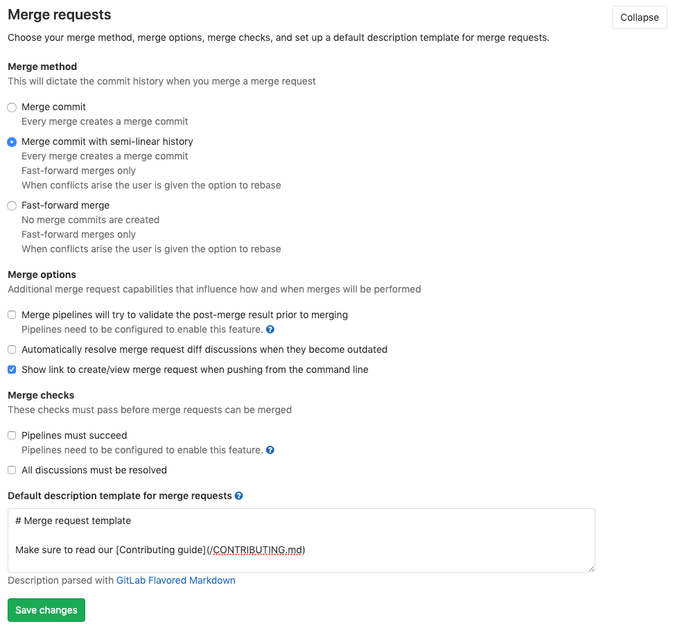
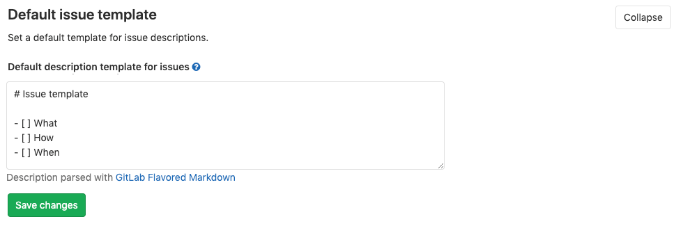

# Description templates

>[Introduced](https://gitlab.com/gitlab-org/gitlab-foss/-/merge_requests/4981) in GitLab 8.11.

We all know that a properly submitted issue is more likely to be addressed in
a timely manner by the developers of a project.

Description templates allow you to define context-specific templates for issue
and merge request description fields for your project, as well as help filter
out a lot of unnecessary noise from issues.

## Overview

By using the description templates, users that create a new issue or merge
request can select a description template to help them communicate with other
contributors effectively.

Every GitLab project can define its own set of description templates as they
are added to the root directory of a GitLab project's repository.

Description templates must be written in [Markdown](../markdown.md) and stored
in your project's repository under a directory named `.gitlab`. Only the
templates of the default branch will be taken into account.

## Use-cases

- Add a template to be used in every issue for a specific project,
  giving instructions and guidelines, requiring for information specific to that subject.
  For example, if you have a project for tracking new blog posts, you can require the
  title, outlines, author name, author social media information, and so on.
- Following the previous example, you can make a template for every MR submitted
  with a new blog post, requiring information about the post date, frontmatter data,
  images guidelines, link to the related issue, reviewer name, and so on.
- You can also create issues and merge request templates for different
  stages of your workflow, for example, feature proposal, feature improvement, or a bug report.

## Creating issue templates

Create a new Markdown (`.md`) file inside the `.gitlab/issue_templates/`
directory in your repository. Commit and push to your default branch.

To create a Markdown file:

 1. Click the `+` button next to `master` and click **New file**.
 1. Add the name of your issue template to the **File name** text field next to `master`.
    Make sure words are separated with underscores and that your file has the `.md` extension, for
    example `feature_request.md`.
 1. Commit and push to your default branch.

If you don't have a `.gitlab/issue_templates` directory in your repository, you'll need to create it.

To create the `.gitlab/issue_templates` directory:

 1. Click the `+` button next to `master` and select **New directory**.
 1. Name this new directory `.gitlab` and commit to your default branch.
 1. Click the `+` button next to `master` again and select **New directory**.This time, n
 1. Name your directory `issue_templates` and commit to your default branch.

To check if this has worked correctly, [create a new issue](./issues/managing_issues.md#create-a-new-issue)
and see if you can choose a description template.

## Creating merge request templates

Similarly to issue templates, create a new Markdown (`.md`) file inside the
`.gitlab/merge_request_templates/` directory in your repository. Commit and
push to your default branch.

## Using the templates

Let's take for example that you've created the file `.gitlab/issue_templates/Bug.md`.
This will enable the `Bug` dropdown option when creating or editing issues. When
`Bug` is selected, the content from the `Bug.md` template file will be copied
to the issue description field. The 'Reset template' button will discard any
changes you made after picking the template and return it to its initial status.


## Setting a default template for merge requests and issues  **(STARTER)**

> - This feature was introduced before [description templates](#overview) and is available in [GitLab Starter](https://about.gitlab.com/pricing/). It can be enabled in the project's settings.
> - Templates for issues were [introduced](https://gitlab.com/gitlab-org/gitlab/-/merge_requests/28) in GitLab EE 8.1.
> - Templates for merge requests were [introduced](https://gitlab.com/gitlab-org/gitlab/commit/7478ece8b48e80782b5465b96c79f85cc91d391b) in GitLab EE 6.9.

The visibility of issues and/or merge requests should be set to either "Everyone
with access" or "Only Project Members" in your project's **Settings / Visibility, project features, permissions** section, otherwise the
template text areas won't show. This is the default behavior so in most cases
you should be fine.

1. Go to your project's **Settings**.
1. Click **Expand** under the **Merge requests** header.
1. Fill in the **Default description template for merge requests** text area.
1. Click **Expand** under **Default issue template**.
1. Fill in the **Default description template for issues** text area.
   Since GitLab merge request and issues support [Markdown](../markdown.md), you can use it to format
   headings, lists, and so on.





After you add the description, hit **Save changes** for the settings to take
effect. Now, every time a new merge request or issue is created, it will be
pre-filled with the text you entered in the template(s).

## Description template example

We make use of Description Templates for Issues and Merge Requests within the GitLab Community
Edition project. Please refer to the [`.gitlab` folder](https://gitlab.com/gitlab-org/gitlab/tree/master/.gitlab)
for some examples.

TIP: **Tip:**
It's possible to use [quick actions](quick_actions.md) within description templates to quickly add
labels, assignees, and milestones. The quick actions will only be executed if the user submitting
the issue or merge request has the permissions to perform the relevant actions.

Here is an example of a Bug report template:

```plaintext
Summary

(Summarize the bug encountered concisely)


Steps to reproduce

(How one can reproduce the issue - this is very important)


Example Project

(If possible, please create an example project here on GitLab.com that exhibits the problematic behaviour, and link to it here in the bug report)

(If you are using an older version of GitLab, this will also determine whether the bug has been fixed in a more recent version)


What is the current bug behavior?

(What actually happens)


What is the expected correct behavior?

(What you should see instead)


Relevant logs and/or screenshots

(Paste any relevant logs - please use code blocks (```) to format console output,
logs, and code as it's very hard to read otherwise.)


Possible fixes

(If you can, link to the line of code that might be responsible for the problem)

/label ~bug ~reproduced ~needs-investigation
/cc @project-manager
/assign @qa-tester
```
